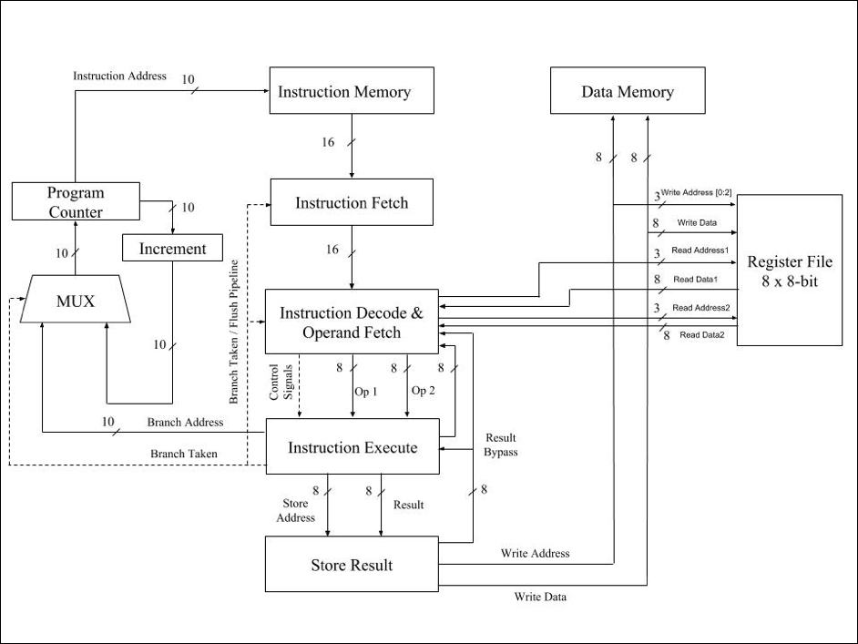

# 8 Bit Simple RISC Processor

This project is a Verilog RTL model of an pipelined 8 bit Simple RISC processor. 

An instruction set for the RISC pipeline has been designed that is compact yet comprehensive so that it can execute general purpose instructions. The types of instructions chosen are arithmetic, logical, branch, shift, load and store instructions. 

The instruction set is:
1. NOP
2. Add
3. Subtract
4. Logical AND
5. Logical OR
6. Logical NOT
7. Left Shift
8. Jump
9. Load
10. Store
11. Bitwise AND
12. Bitwise OR
13. Bitwise NOT
14. Compare
15. Jump on greater than
16. Jump on less than
17. Jump on equal
18. Jump on carry

The architecture diagram for the processor is:

